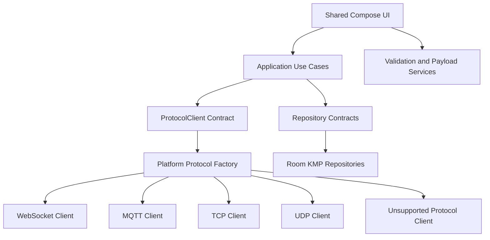

<div align="center">

# MSA IoT Lab

### Cross-platform protocol workbench for IoT and real-time backend testing

A Kotlin Multiplatform and Compose Multiplatform application for creating  
connection profiles, testing MQTT/WebSocket/TCP/UDP endpoints, inspecting live  
traffic, validating payloads and preserving reusable protocol workflows.

[](https://github.com/ALISCHILLER/msa-iot-lab-kmp/actions/workflows/ci.yml)
[](https://kotlinlang.org/)
[](https://www.jetbrains.com/compose-multiplatform/)
[](https://developer.android.com/kotlin/multiplatform/room)
[](#platform-support)
[](#license)

[Features](#features) •
[Platform Support](#platform-support) •
[Architecture](#architecture) •
[Getting Started](#getting-started) •
[Testing](#testing-and-quality) •
[Security](#security-considerations)

</div>

---

## Overview

**MSA IoT Lab** is a Postman-like engineering workbench for device protocols, local-network services and real-time backend systems.

The application provides shared Compose UI and common business logic across supported platforms while keeping transport engines, database paths and platform capabilities behind explicit abstractions.

It is designed for workflows such as:

- Testing an MQTT broker or embedded device
- Opening and inspecting WebSocket sessions
- Sending raw TCP frames
- Listening for UDP packets and broadcasts
- Replaying templated payloads
- Comparing protocol behavior
- Debugging connection failures
- Preserving profiles, sessions and traffic history
- Exporting and importing a reusable test workspace

---

## Features

### Protocol workbench

- MQTT publish and subscribe
- WebSocket send and receive
- Raw TCP socket send and receive
- UDP send, listen and broadcast
- Shared connection-state model
- Retry-aware connection attempts
- Safe connection and disconnection handling
- Clear unsupported-protocol behavior on limited platforms
- Protocol capability registry
- Connection-state guards that prevent invalid sends

### Connection profiles

- Reusable connection profiles
- Protocol-specific configuration
- Host and port validation
- MQTT topic validation
- Strict MQTT wildcard rules
- WebSocket header JSON validation
- Profile defaults and typed profile models
- Persisted profile inventory
- Shared profile editor across platforms

### Live Console

- Real-time traffic console
- `IN`, `OUT`, `SYSTEM` and `ERROR` event categories
- Command editor
- Connection diagnostics
- Auto-repeat sender
- Retry controls
- Traffic counters and session metrics
- Two-pane desktop workbench layout
- Compact responsive layout for smaller displays
- Persisted session and message history

### Payload tools

- `TEXT`
- `JSON`
- `HEX`
- `BASE64`
- JSON pretty-printing
- JSON minification
- Pre-send validation
- Payload-size safety policy
- Reusable payload templates
- Template validation
- Runtime variables:
  - `{timestamp}`
  - `{uuid}`
  - `{counter}`

### Workspace import and export

- JSON profile export
- JSON template export
- Workspace import
- Schema-version validation
- Duplicate-ID rejection
- Invalid-profile rejection before persistence
- Secret masking by default
- Explicit secret inclusion when requested
- Deterministic timestamps for testability

### Persistence

- Room KMP entities and DAOs in `commonMain`
- Platform-specific database builders
- Bundled SQLite driver
- Shared repositories
- Persisted profiles
- Persisted templates
- Persisted sessions
- Persisted traffic history
- Persisted UI language selection
- Committed Room schema exports for migration review

### User experience

- English and Persian UI
- Runtime language switching
- RTL support for Persian
- Room-backed language persistence
- Responsive phone, tablet, foldable and desktop layouts
- Desktop navigation sidebar
- Dashboard metrics
- In-app setup guide
- In-app operator guide
- Dedicated profile, console, history, template and settings screens

---

## Platform Support

| Capability | Android | Desktop JVM | iOS |
|---|:---:|:---:|:---:|
| Shared Compose UI | ✅ | ✅ | ✅ |
| Room KMP | ✅ | ✅ | ✅ |
| MQTT | ✅ | ✅ | Safe unsupported client |
| WebSocket | ✅ | ✅ | ✅ |
| Raw TCP | ✅ | ✅ | Safe unsupported client |
| UDP | ✅ | ✅ | Safe unsupported client |
| Import/export domain logic | ✅ | ✅ | ✅ |
| Shared tests | ✅ | ✅ | ✅ |

### Platform notes

**Android and Desktop JVM** are the complete raw IoT testing targets.

**iOS** currently includes the shared UI, common domain logic, Room KMP and WebSocket support. MQTT, TCP and UDP are represented by `UnsupportedProtocolClient`, which reports a clear capability error through the same `ProtocolClient` contract instead of forcing platform checks into the UI.

iOS targets are registered only on macOS hosts:

- `iosArm64`
- `iosSimulatorArm64`

A macOS machine with Xcode is required to build and host the generated iOS framework.

---

## Tech Stack

| Area | Technology |
|---|---|
| Language | Kotlin `2.2.21` |
| Multiplatform | Kotlin Multiplatform |
| UI | Compose Multiplatform `1.11.1`, Material 3 |
| Dependency processing | KSP `2.2.21-2.0.5` |
| Persistence | Room KMP `2.8.4` |
| SQLite | Bundled SQLite `2.6.2` |
| Networking | Ktor `3.2.3` |
| MQTT | HiveMQ MQTT Client `1.3.14` |
| Concurrency | Coroutines `1.10.2`, Flow |
| Serialization | kotlinx.serialization `1.9.0` |
| Lifecycle | JetBrains AndroidX Lifecycle `2.9.2` |
| Build | Gradle Wrapper `9.5.0`, AGP `8.7.3` |
| Testing | kotlin-test, coroutines-test, protocol fakes |
| Audit | Python static architecture and source audit |

---

## Architecture

The project follows dependency inversion and keeps shared UI independent from concrete transport and persistence engines.



### Core engineering principles

- **Single Responsibility**  
  UI renders state and delegates work. Validation, profile construction, console orchestration, message creation and persistence live in focused components.

- **Open/Closed**  
  A new protocol can be introduced by implementing `ProtocolClient` and registering it in a platform factory.

- **Liskov Substitution**  
  Unsupported protocols use the same transport contract and publish normal connection/error events.

- **Interface Segregation**  
  Persistence, transport, import/export, templates and history use separate contracts.

- **Dependency Inversion**  
  Shared code depends on repositories, protocol contracts and use cases—not concrete sockets, Room builders or MQTT engines.

### Protocol contract

```kotlin
interface ProtocolClient {
    val state: StateFlow<ConnectionState>
    val events: Flow<ProtocolEvent>

    suspend fun connect(profile: ConnectionProfile)
    suspend fun disconnect()
    suspend fun send(payload: OutgoingPayload)
}
```

The UI does not need platform-specific branches to connect, disconnect or send data.

---

## Project Structure

```text
MSA-IoT-Lab
├── composeApp/
│   ├── schemas/                         # Exported Room schemas
│   └── src/
│       ├── commonMain/
│       │   └── kotlin/com/msa/iotlab/
│       │       ├── console/             # Console orchestration, retry and commands
│       │       ├── core/                # Time, IDs, dispatchers and shared utilities
│       │       ├── database/            # Room KMP entities, DAOs and database
│       │       ├── di/                  # Explicit composition root
│       │       ├── export/              # Workspace import/export
│       │       ├── history/             # Session and traffic persistence
│       │       ├── payload/             # Codecs, formatters and variables
│       │       ├── profile/             # Profile domain and persistence
│       │       ├── protocol/            # Transport contracts and events
│       │       ├── template/            # Payload-template domain
│       │       ├── ui/                  # Shared Compose UI
│       │       └── validation/          # Shared validation rules
│       ├── commonTest/                   # Shared deterministic tests
│       ├── jvmSharedMain/                # MQTT/TCP/UDP shared by Android/Desktop
│       ├── androidMain/                  # Android entry point and platform services
│       ├── desktopMain/                  # Desktop entry point and platform services
│       └── iosMain/                      # iOS WebSocket and platform services
├── docs/                                # Setup, operations and engineering guides
├── tools/                               # Static audit and quality scripts
├── gradle/                              # Version catalog and wrapper
├── settings.gradle.kts
└── README.md
```

---

## Requirements

### Android and Desktop

- Windows, Linux or macOS
- JDK `21`
- Android Studio or IntelliJ IDEA with Kotlin Multiplatform support
- Android SDK for the Android target
- Python `3` for the static audit
- Network access to the device, broker or backend under test
- Internet access for the first Gradle dependency sync

### iOS

- Apple Silicon macOS
- Xcode
- JDK `21`
- Kotlin Multiplatform-compatible IDE tooling

---

## Getting Started

### Clone the repository

```bash
git clone https://github.com/ALISCHILLER/msa-iot-lab-kmp.git
cd msa-iot-lab-kmp
```

The repository includes a Gradle Wrapper, so a separate Gradle installation is not required.

### Verify the environment

```bash
./gradlew --version
python3 tools/static_audit.py
```

On Windows PowerShell:

```powershell
.\gradlew.bat --version
python tools/static_audit.py
```

### Run Desktop

Desktop is the preferred target for heavy protocol debugging because it provides the expanded workbench layout.

```bash
./gradlew :composeApp:run
```

On Windows:

```powershell
.\gradlew.bat :composeApp:run
```

### Build Android

```bash
./gradlew :composeApp:assembleDebug
```

On Windows:

```powershell
.\gradlew.bat :composeApp:assembleDebug
```

The Android application can also be launched from the `composeApp` run configuration in Android Studio.

### Desktop native distributions

The desktop configuration supports:

- Windows MSI
- Linux DEB
- macOS DMG

Generate the current-host package with the corresponding Compose Desktop packaging task.

---

## Typical Operator Workflow

1. Create a profile from **Dashboard** or **Profiles**.
2. Select MQTT, WebSocket, TCP or UDP.
3. Configure host, port, encoding and protocol-specific options.
4. Open **Live Console**.
5. Review validation and capability diagnostics.
6. Connect to the endpoint.
7. Send TEXT, JSON, HEX or Base64 payloads.
8. Inspect `IN`, `OUT`, `SYSTEM` and `ERROR` traffic events.
9. Review the persisted session history.
10. Save reusable templates.
11. Export or import the workspace from **Settings**.

---

## Payload Examples

### JSON

```json
{
  "deviceId": "sensor-01",
  "timestamp": "{timestamp}",
  "requestId": "{uuid}",
  "sequence": "{counter}",
  "temperature": 24.8
}
```

### HEX

```text
AA 01 10 FF 0D 0A
```

### MQTT topics

```text
devices/+/telemetry
devices/device-01/commands
factory/line-01/#
```

Publish and subscribe topics are validated separately so invalid wildcard use is rejected before connection or send operations.

---

## Testing and Quality

### Run shared tests

```bash
./gradlew :composeApp:allTests
```

### Compile Desktop

```bash
./gradlew :composeApp:compileKotlinDesktop
```

### Build Android

```bash
./gradlew :composeApp:assembleDebug
```

### Run the complete local quality gate

```bash
bash tools/run_quality_checks.sh
```

The quality script runs:

1. `tools/static_audit.py`
2. Shared tests
3. Desktop compilation
4. Android debug build

### Test strategy

The shared test suite covers:

- Profile validation
- Payload validation
- MQTT topic validation
- Payload encoding and formatting
- Protocol capabilities
- Console retry success and failure
- Session lifecycle persistence
- Send guards
- Auto-repeat validation
- Runtime payload variables
- Import/export behavior
- Secret masking
- Duplicate workspace IDs
- Unsupported schema versions
- Repository and use-case behavior
- Localization helpers
- Deterministic timestamps and IDs

### Test fixtures

- `FakeProtocolClient`
- `RecordingConsoleHistoryGateway`
- `InMemoryProfileRepository`
- `InMemoryPayloadTemplateRepository`
- `TestAppDispatchers`
- `FixedTimeProvider`
- `SequentialIdProvider`

These fixtures allow high-value common logic to be tested without opening real sockets or requiring a physical database.

---

## Static Audit

Run:

```bash
python3 tools/static_audit.py
```

The audit checks areas such as:

- Required package declarations
- KDoc coverage for type declarations
- TODO and FIXME markers
- Brace balance outside literals and comments
- Architecture import boundaries
- UI boundary rules
- Common-test assertion imports
- Suspicious Kotlin syntax patterns

Treat the audit as a dependency-free guardrail. It complements—but does not replace—Gradle compilation, platform tests and protocol integration tests.

---

## Continuous Integration

GitHub Actions is configured for pushes and pull requests targeting `main`.

The current workflow:

- Checks out the repository
- Configures Temurin JDK 21
- Runs `tools/run_quality_checks.sh`

The workflow is configured to execute the static audit and, when the Gradle Wrapper is executable, the shared tests, Desktop compilation and Android debug build.

A green workflow run should be required before treating a commit as verified.

---

## Security Considerations

MSA IoT Lab is a protocol-testing tool and intentionally supports local, insecure and cleartext endpoints. This is useful for labs and embedded-device environments, but it requires explicit operational care.

### Current Android protections

- Auto Backup is disabled.
- Connection data is not copied through Android backup.
- A dedicated network-security configuration is declared.
- Cleartext traffic is explicitly enabled for local MQTT/TCP/WebSocket testing.
- Workspace exports mask secrets by default.
- Secret inclusion requires an explicit choice.

### Current risks and hardening gaps

- MQTT passwords are not yet stored in platform-secure storage.
- Cleartext connections can expose credentials and payloads.
- Certificate pinning is not implemented.
- Custom trust-store support is not implemented.
- Large traffic histories do not yet use paging.
- Protocol integration tests against isolated local servers are still needed.

### Recommended operational rules

- Prefer TLS whenever the target supports it.
- Use dedicated test credentials.
- Do not reuse production broker passwords.
- Do not export secrets unless required.
- Avoid public networks when testing cleartext protocols.
- Treat exported workspaces as sensitive data.
- Review imported files before connecting.
- Never commit real endpoints, credentials or client certificates.

---

## Documentation

### English

- [Setup and Operation Guide](docs/SETUP_AND_OPERATION_GUIDE_EN.md)
- [Testing Strategy](docs/TESTING_STRATEGY.md)
- [Android Security Notes](docs/ANDROID_SECURITY.md)

### فارسی

- [فهرست مستندات پروژه](docs/PROJECT_DOCUMENTATION_INDEX_FA.md)
- [نیازمندی‌های سیستم و ابزارها](docs/REQUIREMENTS_FA.md)
- [راهنمای راه‌اندازی و اجرا](docs/SETUP_AND_RUN_FA.md)
- [راهنمای کامل اپراتور](docs/COMPLETE_OPERATOR_GUIDE_FA.md)
- [راهنمای عملیاتی پروتکل‌ها](docs/OPERATOR_RUNBOOK_FA.md)
- [راهنمای توسعه‌دهنده](docs/DEVELOPER_GUIDE_FA.md)
- [چک‌لیست نهایی انتشار](docs/FINAL_RELEASE_CHECKLIST_FA.md)
- [قواعد کامنت و KDoc](docs/COMMENTING_AND_CODE_STYLE_FA.md)

---

## Current Limitations

- iOS does not yet provide native MQTT, TCP or UDP engines.
- Import/export still needs platform-native file pickers.
- Secret storage is not yet encrypted with Keychain/Keystore.
- TLS pinning and custom trust stores are not implemented.
- Large traffic histories need paging.
- CI does not yet use a full Android/Desktop/iOS build matrix.
- Platform protocol smoke tests are not yet automated.
- Coverage reports are not currently published.
- There is no explicit repository license file.

---

## Roadmap

- [ ] Add secure Android Keystore and iOS Keychain secret storage
- [ ] Add TLS certificate pinning and custom trust stores
- [ ] Add native platform file pickers
- [ ] Add paging for large traffic histories
- [ ] Add local MQTT/WebSocket/TCP/UDP integration-test servers
- [ ] Add Android instrumentation tests for Room migrations
- [ ] Add Desktop protocol smoke tests
- [ ] Add iOS framework build verification on macOS CI
- [ ] Add a complete CI build matrix
- [ ] Publish test and coverage reports
- [ ] Add screenshots and a short demo video
- [ ] Publish signed Desktop and Android releases
- [ ] Add an explicit open-source license or usage license
- [ ] Add `SECURITY.md`, issue templates and contribution guidelines

---

## License

No explicit `LICENSE` or `LICENSE.md` file is currently included in this repository.

Until the project owner adds a license, external reuse, modification and redistribution permissions are not defined by the repository. Add an explicit license before presenting the project as an open-source package or accepting third-party distribution.

---

## Author

Developed and maintained by
[Ali Soleimani](https://github.com/ALISCHILLER).

Bug reports, protocol proposals and pull requests are welcome through GitHub.
